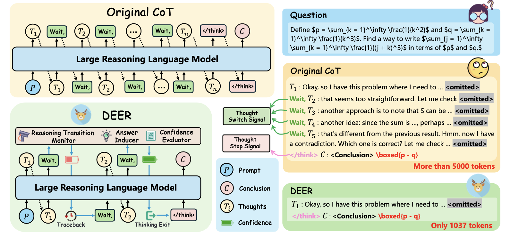

# DEER 🦌: Dynamic Early Exit in Reasoning Models
This is the repository of our paper: [Dynamic Early Exit in Reasoning Models](https://arxiv.org/abs/2504.15895).

<p align="center">        </p>


## Updates
- [2025/05/20] We've released the DEER code on mathematical reasoning tasks implemented based on **HuggingFace Transformers** and **vLLM**.

## Overview

DEER monitors model behavior at potential reasoning transition points and dynamically terminates the next reasoning chain’s generation when the model exhibits high confidence in a trial answer. It is consistently effective on 11 cutting-edge reasoning LLMs of varying series and sizes, reducing the length of CoT sequences by an average of 19.1% to 80.1% while improving accuracy by 0.3% to 5.0%.

## Inference

We have implemented DEER based on both Hugging Face Transformers and vLLM. 
Considering efficiency, we recommend reproducing the results using the code based on the **vLLM** framework.

### vLLM

#### Most LRLMs

Execute inference by running the script *./bashes/bash-vllm-deer.sh*.

Provide the following arguments.
```
python ../vllm-deer.py \
    --model_name_or_path "" \
    --dataset_dir "" \
    --output_path "" \
    --dataset "" \
    --threshold  \
    --max_generated_tokens  \
    --think_ratio  \
    --batch_size  \
    --dtype  \
    --gpu-memory-utilization  
```


#### Qwen3

In our experiments, we found that Qwen3-series models tend to be over-confident in confidence prediction, so we made some modifications to its implementation. For inference with Qwen3 models, please run the script *./bashes/bash-vllm-deer-qwen3.sh*.

Provide the following arguments.
```
python ../vllm-deer-qwen3.py \
    --model_name_or_path "" \
    --dataset_dir "" \
    --output_path "" \
    --dataset "" \
    --threshold  \
    --max_generated_tokens  \
    --think_ratio  \
    --batch_size  \
    --dtype  \
    --gpu-memory-utilization  
```

### transformers

Execute inference by running the script *./bashes/bash-vanilla-deer.sh*.


## Evaluation

DEER currently supports evaluation on 7 reasoning benchmarks. The rule-based evaluation for these benchmarks is based on the code implementation from the project [LIMO](https://github.com/GAIR-NLP/LIMO/tree/main).

Execute the evaluation by running the script *./bashes/bash-check-correct.sh*.

Provide the following arguments to run the answer checking script *bash-check-correct.sh*.
```
python ../check.py \
    --model_name_or_path "" \
    --data_name "" \
    --generation_path ""
```

## TODO

- We will release the DEER implementation for code generation tasks.
- We will release the DEER improved with Branch-Parallel Decoding Acceleration.


## License

This project is licensed under the MIT License.

## Citation

```bibtex
@misc{yang2025dynamicearlyexitreasoning,
      title={Dynamic Early Exit in Reasoning Models}, 
      author={Chenxu Yang and Qingyi Si and Yongjie Duan and Zheliang Zhu and Chenyu Zhu and Qiaowei Li and Zheng Lin and Li Cao and Weiping Wang},
      year={2025},
      eprint={2504.15895},
      archivePrefix={arXiv},
      primaryClass={cs.CL},
      url={https://arxiv.org/abs/2504.15895}, 
}
```
## Discussion

Wechat Discussion Group:
<p align="center">        </p>
